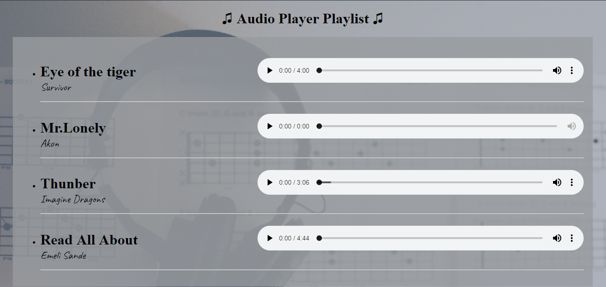

# Audio-player-Playlist
Audio Player playlist that allows adding tracks, creating the layout of the playlist using HTML/CSS,
retrieving the playlist data remotely using AJAX and based on the retrieved data, create an interface for each track.

# Built With
HTMl. 
CSS.
Java Script.
jQuery. 
AJAX.

